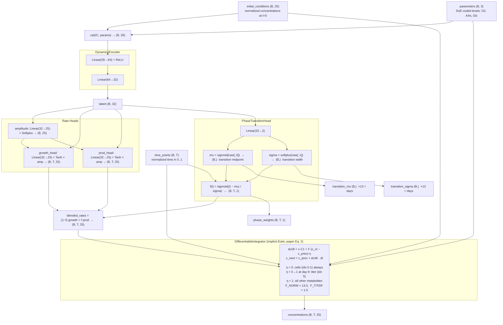

# COSMIC dFBA Neural Network Surrogate Model

A PyTorch surrogate model for predicting bioreactor phase transitions and metabolite trajectories, trained on experimental dFBA data from 10 perfusion reactors.

The primary prediction goal is transition timing for root cause analysis (RCA): predicting when and how a cell line switches from growth phase to production phase, not just final titer. The loss is weighted accordingly, favoring phase transition accuracy over titer. The phase prediction head explicitly outputs two interpretable parameters per reactor: mu (transition midpoint in days) and sigma (transition sharpness in days). Evaluation includes phase AUC, which captures both timing and sharpness of the transition in a single number, alongside transition MAE and standard classification metrics.

**Latest LOO results (FC model, DoE-only inputs, seed=42):** f(t) accuracy +/-0.1: 83.8% (paper: 72.3%) | MCC: 0.906 (paper: 0.454) | Transition MAE: 1.40d | Phase AUC MAE: 0.33d | Shuffled baseline: 2.32d

LSTM variant (same inputs, time-varying rates): LOO MAE 1.46d, f(t) 80.0% -- worse on all metrics. Constant-rate FC is the final model.

---

## Files

| File | Purpose |
|------|---------|
| `nn/model.py` | Model classes: dataset, encoder, rate heads, phase head, ODE integrator |
| `nn/train.py` | Leave-one-out training on real reactor data |
| `nn/evaluate.py` | Evaluation metrics and comparison plots vs. paper benchmarks |
| `nn/utils.py` | Data loading, normalization, and diagnostic utilities |
| `nn/data/data_1.csv` | DoE coded levels per reactor (O2, AAs, Glc: -1 / 0 / +1) -- model input |
| `nn/data/data_2.csv` | State variable trajectories over time (25 components, 10 reactors) -- model target |
| `nn/data/data_3.csv` | Phase-specific metabolic rates -- not used as model input (requires dFBA) |
| `nn/data/data_4.csv` | FBA objective efficiencies -- not used as model input (requires dFBA) |

---

## Data Layout

**Dimensions used throughout:**

| Symbol | Value | Meaning |
|--------|-------|---------|
| B | 4 (train) / 1 (val) | Batch size |
| T | 13 | Time points per reactor (one per day, day 0-12) |
| C | 25 | Metabolite components |
| n_params | 3 | DoE coded levels: O2, AAs, Glc |
| latent_dim | 32 | Latent state dimension |

**Component layout (C=25):**

| Index | Component |
|-------|-----------|
| 0 | Cell Density |
| 1 | Cell Volume |
| 2 | Glucose |
| 3 | Lactate |
| 4 | Ammonia |
| 5 | Titer (antibody) |
| 6-24 | Amino acids (Glutamine ... Tryptophan) |

**Parameter layout (n_params=3):**

| Index | Content |
|-------|---------|
| 0 | O2 coded level (-1, 0, +1) |
| 1 | AAs coded level (-1, 0, +1) |
| 2 | Glc coded level (-1, 0, +1) |

FBA-derived features (data_3 specific rates, data_4 efficiencies) were tested and dropped. They require running dFBA first, which defeats the purpose of a surrogate model. Ablation: removing them costs ~0.3d on LOO transition MAE (1.28d -> 1.60d).

---

## Model Architecture

The architecture was deliberately kept minimal. With 10 reactors and 3 DoE inputs the problem is low-dimensional, so simpler generalizes better.

Earlier iterations used an LSTM or transformer to predict time-varying rate tensors `(B, T, 25)` and ran the ODE twice (once growth-only to inform the phase head, once blended). Ablations showed this added complexity without improving LOO performance. The current design predicts constant rates per phase -- biologically appropriate since dFBA rates are phase-constant -- and runs a single ODE pass.



---

## Training Loop

```
TRAINING DATA: 9 reactors per fold, batch_size=4
  ic:      (4, 25)      initial conditions (normalized)
  time:    (4, 13)      normalized time [0, 1]
  params:  (4, 3)       DoE coded levels: O2, AAs, Glc
  target:  (4, 13, 25)  ground truth state variable trajectories
  phases:  (4, 13)      ground truth f(t) phase fraction
        │
        ▼
┌─────────────────────────────────────────────────────────────┐
│  FORWARD PASS                                               │
│  predictions = model(ic, time, params)                      │
│  OUT: concentrations  (4, 13, 25)                           │
│       phase_weights   (4, 13, 1)                            │
│       growth_rates    (4, 13, 25)                           │
│       prod_rates      (4, 13, 25)                           │
└─────────────────────────────────────────────────────────────┘
        │
        ▼
┌─────────────────────────────────────────────────────────────┐
│  LOSS COMPUTATION  (Trainer.compute_loss)                   │
│                                                             │
│   1. Concentration MSE (weight 1.0)                         │
│        cell density (idx 0): 3x weight -- primary RCA target│
│        titer (idx 5): 2x weight                             │
│      IN:  concentrations (4,13,25) vs target (4,13,25)      │
│                                                             │
│   2. Endpoint titer loss (weight 0.5)                       │
│      IN:  concentrations[:,−1,5] vs target[:,−1,5]          │
│                                                             │
│   3. Peak-time alignment (weight 1.0)                       │
│      soft-argmax on titer trajectory to align peak day      │
│                                                             │
│   4. Initial condition constraint (weight 0.1)              │
│      IN:  concentrations[:,0,:] vs ic (4,25)                │
│                                                             │
│   5. Non-flatness penalty (weight 0.2)                      │
│      penalizes low variance trajectories                    │
│                                                             │
│   6. Non-negativity penalty (weight 0.5)                    │
│      penalizes concentrations < 0                           │
│                                                             │
│   7. Concentration smoothness (weight 0.1)                  │
│      penalizes step-to-step jumps in predicted trajectories │
│                                                             │
│   8. Phase regression MSE (weight 5.0)                      │
│      IN:  phase_weights (4,13,1) vs phases (4,13)           │
│                                                             │
│   9. Rate smoothness (weight 0.1)                           │
│      penalizes step-to-step changes in blended_rates        │
│                                                             │
│  10. Phase smoothness (weight 0.05)                         │
│      penalizes step-to-step changes in f(t)                 │
│                                                             │
│  11. Rate magnitude (weight 0.01)                           │
│      L1 regularization on growth and production rates       │
│                                                             │
│  OUT: total_loss (scalar)                                   │
└─────────────────────────────────────────────────────────────┘
        │
        ▼
┌─────────────────────────────────────────────────────────────┐
│  BACKWARD PASS                                              │
│  loss.backward()                                            │
│  Computes gradients for all parameters:                     │
│    encoder FC weights, rate head weights,                   │
│    amplitude head, phase head, ODE is differentiable        │
└─────────────────────────────────────────────────────────────┘
        │
        ▼
  clip_grad_norm_(max_norm=1.0)   prevents exploding gradients
        │
        ▼
  AdamW step: w = w - lr * (gradient + momentum)
  lr = 1e-4, weight_decay = 1e-5
        │
        ▼
┌─────────────────────────────────────────────────────────────┐
│  AFTER EACH EPOCH                                           │
│  Validate on held-out reactor (1 reactor, batch_size=1)     │
│  Metrics computed: F1, MCC, transition MAE, titer within 10%│
│  ReduceLROnPlateau: halve lr if val_loss stagnates          │
│  Early stopping if no improvement for 80 epochs             │
└─────────────────────────────────────────────────────────────┘
```

---

## Training Strategy

**Leave-one-out cross-validation**: with 10 reactors, each is held out once as the test set. The model trains from scratch for each fold on the remaining 9 reactors. LOO metrics are averaged across all 10 folds and reported as the main generalization estimate.

**Final model**: after LOO, the model is re-trained on all 10 reactors and saved to `improved_model.pt`.

---

## Running

```bash
# Train
python nn/train.py

# Train permutation baseline (shuffle inputs vs outputs to establish chance performance)
python nn/train.py --shuffle

# Evaluate saved model
python nn/evaluate.py
```
